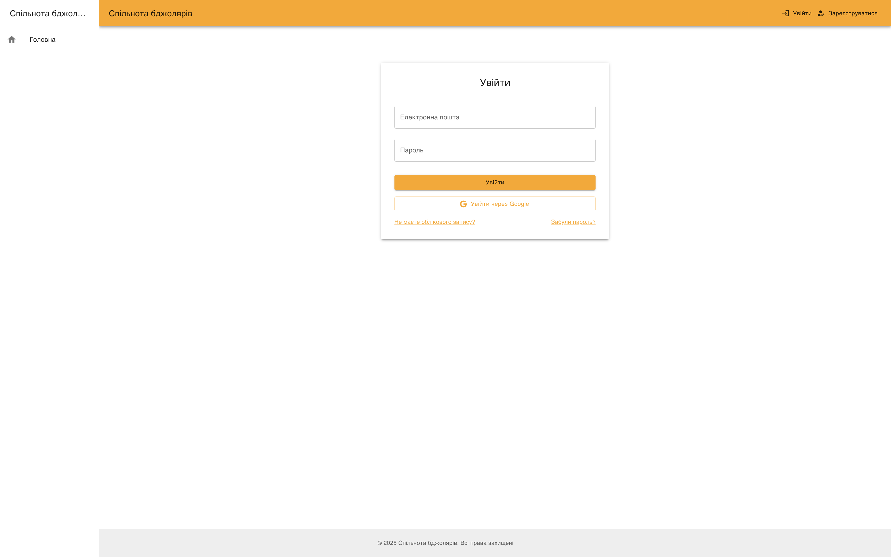
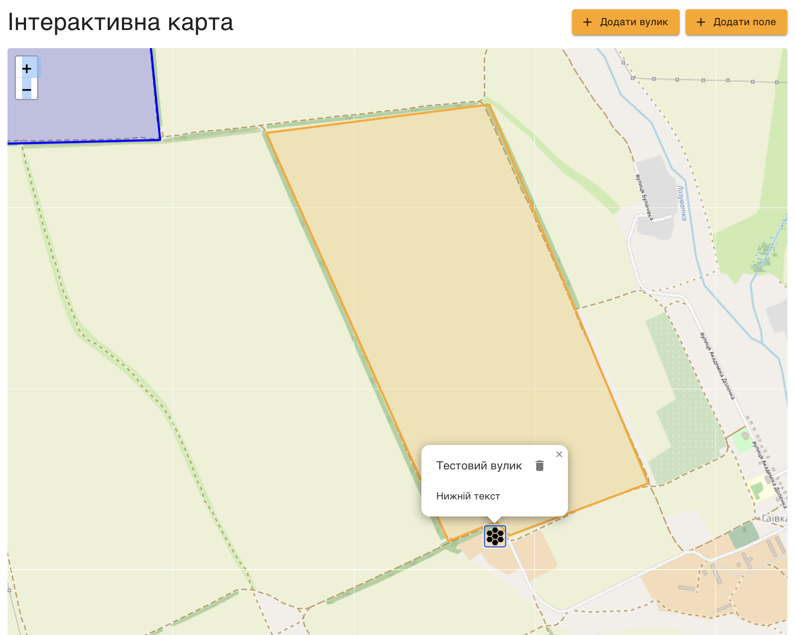
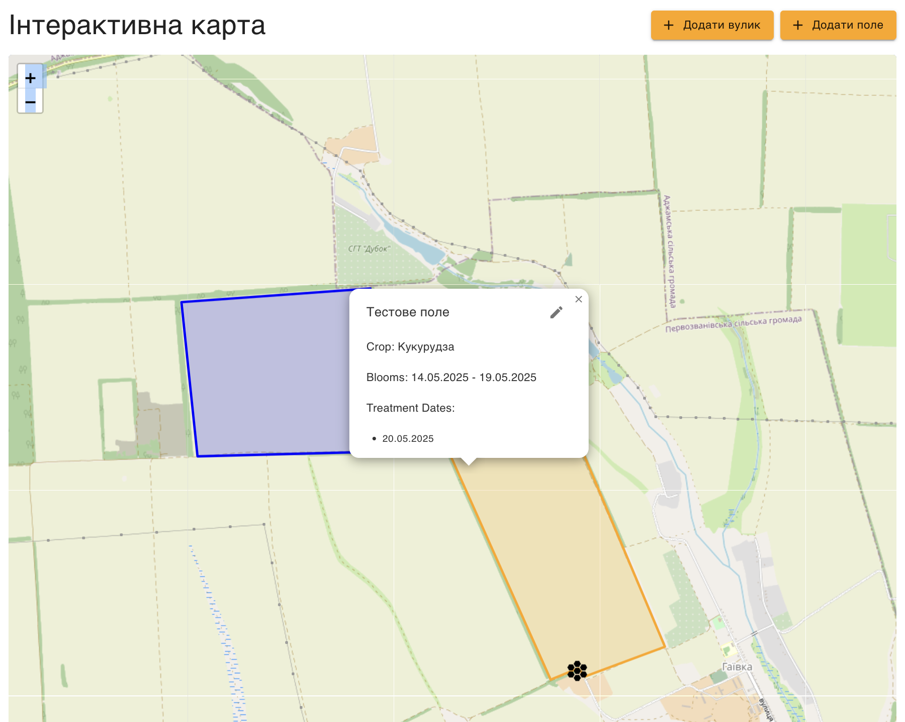
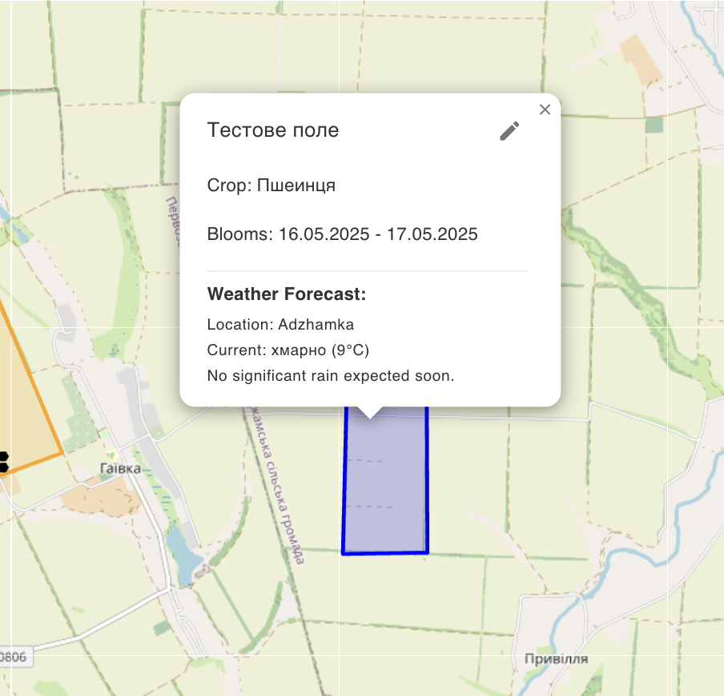
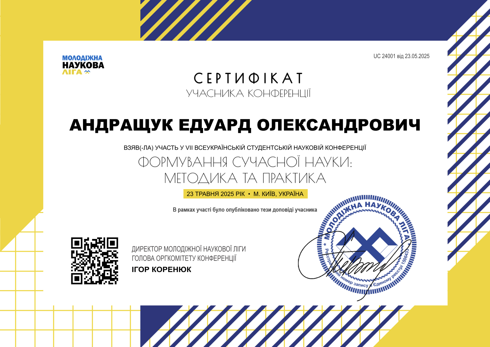

# Розробка веб-платформи для комунікації та обміну знаннями в спільноті бджолярів

*   **Автор:** Едуард АНДРАЩУК
*   **Науковий керівник:** професор, доктор технічних наук Володимир ЗАСЛАВСЬКИЙ
*   Київ – 2025

---

# Актуальність дослідження

*   **Критичний стан галузі бджільництва в Україні:**
    *   За 2022-2023 рр. чисельність бджолосімей скоротилася на 13,8% (до 2,31 млн).
    *   Смертність бджіл у 2024 році зросла до критичних 20-25%.
    *   Економічні збитки оцінюються у 31,9 млн доларів США.
*   **Проблеми координації:**
    *   Відсутність ефективної комунікації між бджолярами та агровиробниками.
    *   Неузгодженість графіків обробки полів пестицидами.
    *   95% пасік належать домогосподарствам, часто не зареєстрованим.
*   **Потреба у спеціалізованих інструментах:** Існуючі загальні платформи не враховують унікальні потреби бджолярської спільноти.

---

# Мета та завдання дослідження

*   **Мета:** Розробка фулстек веб-застосунку – веб-платформи для комунікації та обміну знаннями в спільноті бджолярів *Beekeepers Community Platform*.

*   **Основні завдання:**
    *   Аналіз предметної області та обґрунтування вибору технологічного стеку.
    *   Проектування комплексної архітектури системи.
    *   Реалізація ключового функціоналу (автентифікація, форум, інтерактивна карта, база знань).
    *   Впровадження механізмів безпеки та розробка інтуїтивного UI/UX.
    *   Функціональне тестування та підготовка до розгортання.

---

# Наукова новизна

*   **Інтегрована архітектура:** Синергетичне поєднання засобів соціальної комунікації, спеціалізованої бази знань та геоінформаційного менеджменту для нішевої спільноти бджолярів.

*   **Збалансований технологічний стек:** Обґрунтування ефективності React, NestJS, Leaflet, MongoDB для створення масштабованої платформи агро-геоінформаційних спільнот.

*   **Інтелектуальний FAQ-асистент:** Прототип на основі LLM з адаптованим промпт-інжинірингом для контекстно-залежних відповідей у галузі бджільництва.

---

# Технологічний стек та архітектура

*   **Методологія:** Гнучкі (Agile) підходи, ітеративна розробка.
*   **Інструменти:** Cursor IDE, Git/GitHub, Docker, Render (PaaS).
*   **Технології:**
    *   **Frontend:** React, TypeScript, Vite, Material-UI, Redux Toolkit (RTK Query), Leaflet.
    *   **Backend:** NestJS (Node.js, Fastify), TypeScript, Mongoose ODM.
    *   **База даних:** MongoDB Atlas (з підтримкою GeoJSON, 2dsphere індекси).
    *   **Автентифікація:** Passport.js, JWT, Google OAuth 2.0.
    *   **API:** RESTful з версіонуванням, OpenAPI (Swagger) документація.
    *   **Додатково:** i18next (інтернаціоналізація), Mailgun (email), OpenAI API (FAQ-асистент).

---

# Архітектура системи

*   **Клієнт-серверна архітектура:**
    *   **Frontend:** SPA на React з компонентним підходом.
    *   **Backend:** Модульна архітектура NestJS.
    *   **База даних:** MongoDB з колекціями users, hives, fields, forumposts.

*   **Ключові принципи:**
    *   Модульність та розділення відповідальностей.
    *   RESTful API з автоматичною документацією.
    *   Геопросторові можливості (GeoJSON, 2dsphere індекси).
    *   Безпека (JWT, валідація DTO, CORS, HTTPS).

---

# Система автентифікації та авторизації

*   **Реєстрація та верифікація:**
    *   Створення облікового запису (email/пароль).
    *   Верифікація email (токен дійсний 1 годину).
    *   Можливість повторного надсилання листа верифікації.
*   **Множинні способи входу:**
    *   Локальна стратегія (email/пароль).
    *   Google OAuth 2.0 інтеграція.
*   **Безпека:**
    *   JWT (Access & Refresh токени).
    *   Хешування паролів (crypto.pbkdf2Sync).
*   **Адміністрування:** Управління ролями користувачів.

---

# Сторінка входу до системи

---

# Інтерактивна карта: Управління вуликами

  

*   **Функціонал вуликів:**
    *   Додавання маркерів кліком на карті.
    *   Кастомні іконки (MUI HiveIcon через ReactDOMServer.renderToString).
    *   Popup з детальною інформацією.
    *   Редагування та видалення з підтвердженням.

  

  

  

---

# Інтерактивна карта: Управління полями

  

  

  

*   **Функціонал полів:**
    Малювання полігонів на карті.
    Метадані: назва, тип культури, період цвітіння, дати обробки.
    Редагування.

*   **Візуалізація статусу обробки:**
    Динамічне фарбування полігонів:
    Червоний - обробка поля сьогодні,
    Помаранчевий - скоро,
    Синій - колір за замовчуванням.

  

---

# Інтеграція прогнозу погоди

  

*   **Серверна частина:**
    *   Інтеграція з OpenWeatherMap.
    *   Аналіз опадів.

*   **Клієнтська інтеграція:**
    *   Автоматичне завантаження при відкритті Popup поля.
    *   Відображення температури, ймовірності опадів.
    *   Lazy loading через RTK Query.

  

  

  

---

# Додатковий функціонал

*   **Форум спільноти:**
    *   Створення тем, публікація повідомлень, коментування.
    *   Система лайків, модерація контенту.

*   **База знань:**
    *   Структурований каталог статей з бджільництва.
    *   Пошук та фільтрація за категоріями.

*   **Інтелектуальний FAQ-асистент:**
    *   Прототип на базі OpenAI GPT-3.5-turbo.
    *   Промпт-інжиніринг для контекстно-залежних відповідей.

*   **Інтернаціоналізація:** Підтримка української та англійської мов.

---

# Безпека та розгортання

*   **Заходи безпеки:**
    *   Валідація вхідних даних (DTO + class-validator).
    *   Захист від XSS (React екранування).
    *   Управління секретами через змінні середовища.
    *   HTTPS у продакшн (автоматичні SSL сертифікати Render).

*   **Розгортання на Render PaaS:**
    *   Frontend: Static Site з автоматичною збіркою.
    *   Backend: Docker Web Service.
    *   База даних: MongoDB Atlas (хмарний сервіс).
    *   CI/CD: GitHub Actions для лінтингу, автоматичне розгортання.

---

# Тестування та результати

*   **Види тестування:**
    *   Модульне тестування (Jest для NestJS сервісів).
    *   Інтеграційне тестування (API ендпоінти, взаємодія з БД).
    *   UI тестування (ручне, кросбраузерне, адаптивність).
    *   Тестування безпеки (валідація, автентифікація).

*   **Основні досягнення:**
    *   Повноцінна система автентифікації з OAuth інтеграцією.
    *   Інтерактивна геопросторова компонента з візуалізацією ризиків.
    *   Форум спільноти та база знань.
    *   Сучасна масштабована архітектура.

---

# Практичне значення

*   **Готовий до використання прототип:** Веб-платформа *Beekeepers Community Platform* може бути впроваджена для підтримки спільноти бджолярів України.

*   **Вирішення реальних проблем:**
    *   Покращення комунікації між бджолярами та агровиробниками.
    *   Попередження отруєнь бджіл через візуалізацію обробок полів.
    *   Централізована платформа для обміну знаннями та досвідом.
    *   Інструменти для оптимального розміщення пасік.

*   **Потенціал масштабування:** Архітектура дозволяє розширення функціоналу та адаптацію до інших регіонів.

---

# Майбутні напрямки розвитку

*   **Технічні вдосконалення:**
    *   Повна інтеграція FAQ-асистента з семантичним пошуком.
    *   Система сповіщень про обробку полів поблизу пасік.

*   **Функціональні розширення:**
    *   IoT інтеграція для моніторингу вуликів.
    *   Календар подій та маркетплейс продукції.
    *   Розширена міжнародна підтримка.

*   **Дослідницькі аспекти:**
    *   Аналіз ефективності платформи для спільноти.
    *   Дослідження впливу на координацію дій бджолярів.

---

# Висновки

*   **Успішна реалізація:** Створено повнофункціональну веб-платформу, що об'єднує інструменти для соціальної взаємодії, обміну досвідом та спеціалізовані функції для бджільництва.

*   **Наукові досягнення:**
    *   Розроблено інноваційний метод візуалізації ризиків обробки полів.
    *   Обґрунтовано ефективність обраного технологічного стеку.
    *   Створено прототип інтелектуального асистента для нішевої спільноти.

*   **Практична цінність:** Платформа вирішує реальні проблеми української спільноти бджолярів та може сприяти відновленню галузі після кризи.

*   **Перспективи:** Проект демонструє потенціал сучасних веб-технологій для створення спеціалізованих галузевих рішень.

---

# Апробація результатів

---

# Дякую за увагу!

*   **Питання та обговорення**
*   **Демо платформи:** https://beekeepers-frontend.onrender.com/

**Веб-платформа для комунікації та обміну знаннями в спільноті бджолярів** – інноваційне рішення для підтримки української бджолярської спільноти в умовах сучасних викликів.
